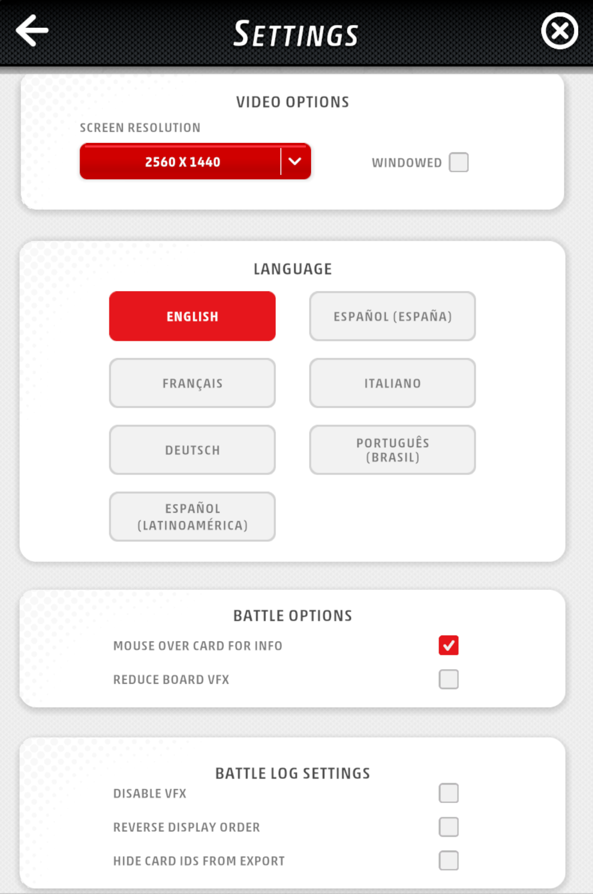

[English](README.md) | [日本語](README.ja.md) | [简体中文](README.zh-CN.md) | [Français](README.fr.md) | [Deutsch](README.de.md) | [Bahasa Indonesia](README.id.md) | [Italiano](README.it.md) | [한국어](README.ko.md) | [Português](README.pt.md) | [Español](README.es.md) | [ภาษาไทย](README.th.md)

# PTCGL Tracker

Alat yang secara otomatis menyimpan log pertarungan yang ditampilkan setelah pertandingan di Pokémon Trading Card Game Live (PTCGL).

## Unduh

[Unduh versi terbaru](https://github.com/1ulce/PTCGL-Tracker-Releases/releases/latest)

| OS | File |
|---|---|
| Windows | `PTCGL Tracker.exe` |
| macOS | `PTCGL Tracker.app.zip` |

## Cara Instalasi

### Windows

1. Unduh `PTCGL Tracker.exe`
2. Tempatkan di folder mana pun dan jalankan
3. Instalasi selesai ketika ikon muncul di system tray

### macOS

1. Unduh `PTCGL Tracker.app.zip`
2. Ekstrak dan pindahkan `PTCGL Tracker.app` ke folder Applications
3. Saat peluncuran pertama, klik kanan → "Buka" untuk menjalankan

## ⚠️ Pengaturan PTCGL (Penting)

Agar analisis replay berfungsi dengan benar, harap konfigurasikan pengaturan berikut di PTCGL.

### 1. Aktifkan Mode Jendela
`VIDEO OPTIONS` → **Centang "WINDOWED"**

Diperlukan agar tracker dapat mengakses file log.

### 2. Atur Bahasa ke Inggris
`LANGUAGE` → **Pilih "ENGLISH"**

Saat ini hanya log bahasa Inggris yang didukung untuk analisis replay.

### 3. Tampilkan ID Kartu
`BATTLE LOG SETTINGS` → **Hapus centang "HIDE CARD IDS FROM EXPORT"**

Tanpa ID kartu, gambar kartu tidak akan ditampilkan di log.

## Cara Penggunaan

1. Jalankan PTCGL Tracker (berjalan di system tray)
2. Selesaikan pertarungan di PTCGL
3. Tombol "BATTLE LOG" di layar hasil akan diklik secara otomatis
4. Log pertarungan disimpan otomatis ke `~/PTCGLLogs/`

## Unggah ke Cloud
Buat akun di PTCGTools dan masuk untuk mengelola log pertarungan dan dek Anda di [situs PTCGL Replayer](https://replay.ptcgtools.com).

## Pembaruan Otomatis

Ketika versi baru dirilis, notifikasi akan muncul saat aplikasi dijalankan.
Anda dapat dengan mudah memperbarui dari menu tray.

## Bahasa yang Didukung

🇯🇵 日本語 | 🇺🇸 English | 🇨🇳 简体中文 | 🇫🇷 Français | 🇩🇪 Deutsch | 🇮🇩 Bahasa Indonesia | 🇮🇹 Italiano | 🇰🇷 한국어 | 🇧🇷 Português | 🇪🇸 Español | 🇹🇭 ภาษาไทย

## Persyaratan Sistem

- Windows 10/11
- macOS 12+

## Lisensi

MIT License

## Laporan Masalah

Silakan laporkan bug dan permintaan melalui [Issues](https://github.com/1ulce/PTCGL-Tracker-Releases/issues).
